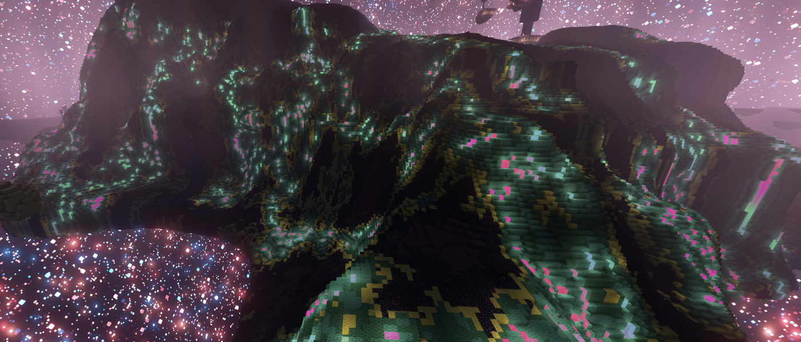

# Lighter End

***A reimagined vision of a Better End***

## What Is This?

LighterEnd transforms Minecraft's least-loved dimension into one full of light, life, wonder and
mystery. It adds:

- **nine** new biomes, each with its own ambient sounds and music
- **seven** new mobs (some friendly, some hostile)
- **six** new stone building materials
- **five** new wood types
- **four** new music discs
- an **armored elytra**
- and much more

through a balanced gameplay experience that will make you want to explore, base and build in The
End, and not just go straight home after raiding an End City.

### A New Future for a Better End

This mod is based on and inspired by [Paulevs](https://github.com/paulevsGitch)' legendary mod,
[BetterEnd](https://github.com/quiqueck/BetterEnd), development on which ceased in 2024 after
over five years. LighterEnd is a ground-up rewrite, built using modern design principles, and has
no dependencies outside of the Fabric API. It is my hope, by making this mod easily
maintainable, with the bare minimum of abstractions, that BetterEnd's _core ethos_ can be carried
through to new Minecraft versions, as they release, with a minimum of effort.

### What We Leave Behind

LighterEnd is **not** and never will be a 1-to-1 recreation of BetterEnd. Explicitly, a lot of
BetterEnd's features were either unbalanced with vanilla Minecraft, were too difficult to maintain
or never worked right to begin with. For example:

- Thallasium and Ender Ore were redundant, and Terminite, Aeternium and Crystalite tool tiers were
  overpowered. LighterEnd introduces no new ores to the game and only one new armor material,
  exclusive to the **Silk Elytra,** which had weaker glide than base elytra, a protection level
  roughly on par with diamond and a durability only slightly better than leather
- LighterEnd does not implement its own terrain generation, instead overlaying biomes onto either
  the Vanilla End or that of a datapack like Nullscape or Stellarity.
- Instead of biome-specific end soil, LighterEnd makes do with one **End Moss** which takes on
  different colors (and bonemeal behaviors) based on the biome it's in
- End Veil is a potion-only effect instead of an enchantment, though intrepid explorers may find
  other ways of avoiding the ire of Endermen
- LighterEnd does not include hammers, forging, infusing or alloying
- LighterEnd has no Eternal Portals—the only ways to make it out of The End alive is
  through the central island.

Regarding BetterEnd's **twenty four** biomes, LighterEnd has **nine** (as of v1.0), along with
six wood sets. While none of BetterEnd's mods are explicitly being excluded, which ones will be
ported, when and how is dependent on interest (the developers' and the community's).

You can find a list of features slated for development, tied to the
["milestone"](https://github.com/OpenBagTwo/LighterEnd/milestones) (release) they're targeted for,
on the [issues page](https://github.com/OpenBagTwo/LighterEnd/issues). If there's a specific biome
or feature (from BetterEnd or no) you'd like to see prioritized, feel free to open
an issue requesting it.

### New Features

On the flip side, LighterEnd has features not present in BetterEnd:

- The option for gravity in The End to be 1/3 of normal
- **Silk Elytra**—a craftable, trimmable and renewable armored elytra
- New survival-challenge-friendly crafting recipes (such as the ability to get paper from the leaves
  of **End Lilies** and arrows from **Cubozoa** drops)
- Sniffers that sploot on **End Moss** will dig up rare End saplings
- **Obelisks** that you can teleport to upon almost dying (meaning your stuff is safe even if you
  fall into The Void)
- **Ice Stars** that contain ice enriched with metals (copper, gold, iron)
- New mobs such as the **Chorus Crab** and **Glossy Mooshroom**

### Broad Compatibility

Lighter End can be installed alongside other End mods, including (but by no means limited to):

- [Nullscape](https://modrinth.com/datapack/nullscape)
- [Moog's End Structures](https://modrinth.com/mod/mes-moogs-end-structures)
- [Elytra Trims](https://modrinth.com/mod/elytra-trims)
- [Better End Sky](https://modrinth.com/mod/better-end-sky)

For a more detailed and up-to-date list of compatible mods and datapacks, consult the
[Lighter End Wiki](https://openbagtwo.github.io/LighterEnd/mods)

If you find a Fabric End mod that _doesn't_ work with LighterEnd, please
[open an issue](https://github.com/OpenBagTwo/LighterEnd/issues/new).

## Contributing

**Worldgen datapack developers wanted!!** If you have experience creating custom dimensions
or adding biomes to existing dimensions, please contact me!

If there is a BetterEnd feature you would like to take responsibility for porting, please
[open an issue](https://github.com/OpenBagTwo/LighterEnd/issues/new) to start that discussion!

### Building the Mod from Source

0. Download and install a Java 21 OpenJDK such as [Temurin](https://adoptium.net/temurin/releases/)
1. Clone this repo
1. Load this project into your favorite Java IDE and run the "runDatagen" gradle task (or, from
   the command line, run `sh ./gradlew runDatagen` from the project root)
1. Now run the "build" task, either from the IDE or via  `sh ./gradlew build`
1. The compiled jar will be found under `build/libs`

### Style Guide

* This project uses [pre-commit](https://pre-commit.com/) hooks to format Markdown
  and non-generated JSON files. To set up pre-commit, follow the instructions linked above to
  install `pre-commit` on your system, then, from the repo root, run `pre-commit install` to
  have the hooks run on every commit.
* It is strongly recommended that you turn on automatic format on save / commit in your Java IDE.
  Instructions for doing that inside IntelliJ can be found
  [here](https://www.jetbrains.com/help/idea/reformat-and-rearrange-code.html#reformat-on-save).
  Make sure to select:
    * Reformat code
    * Optimize imports
      on any save.
* The top priority of this mod is to make it easy to understand and maintain (note that "difficult
  to update" and "tedious to update" are not the same thing). This means that implementations
  should be as "flat" as possible—no interfaces, the bare minimum of abstraction, and any "helper"
  methods should be used at least twice before they're refactored out into their own "library"
  class.
    * And, just to be extra clear: ***this mod should never depend on any other mod, library, API or
      project*** outside the Fabric API. If someone else already solved a thing, adapt how they
      did it (with proper attribution, and assuming it's GPL-compatible open source)—don't just
      count on that library always existing forever.
    * The corollary to the above is that this project will ***never*** be refactored into a
      general-purpose modding library or API. Anyone seeking to adapt the solutions developed for
      this mod is welcome to adapt those bits of code (subject to the license below).

## License and Acknowledgements

All code in this repository is licensed under
[GPLv3](https://www.gnu.org/licenses/gpl-3.0.en.html).

Substantial portions of this mod—including most of its assets—were adapted from BetterEnd and BCLib,
developed primarily by
[**Paulevs**](https://github.com/paulevsGitch) and [**quiqueck**](https://github.com/quiqueck),
in accordance with the terms of their respective licenses:

- https://github.com/quiqueck/BCLib/blob/9607e2e50818c9059505c32c72eb2d8d00bf6e9d/LICENSE
- https://github.com/quiqueck/BetterEnd/blob/00e4892827c4f1b0d2e213348f63e57a647a8011/LICENSE

The Chorus Crab was designed by **Pegnok** of the BetterX Discord.

Music discs were composed, performed and recorded by [Firel](https://www.youtube.com/@FirelMusic).

Many thanks:

- to the excellent tutorial mods developed by
  [Kaupenjoe](https://github.com/Tutorials-By-Kaupenjoe/Fabric-Tutorial-1.21.X) and
  [TurtyWurty](https://github.com/DaRealTurtyWurty/1.21-Tutorial-Mod)
- to [Pintér Gábor](https://github.com/pinter-gabor-at) and his
  [IronSigns mod](https://gitlab.com/pintergabor/ironsigns) for providing an extremely helpful
  example of adding custom signs
- [KikuGie](https://codeberg.org/KikuGie) for their elytra trims
- [TerraformersMC](https://github.com/TerraformersMC) for figuring out how to automate _some_ of the
  ridiculous amount of complexity involved in adding a custom armor material
- to the [Enderscape](https://github.com/they-made-enderscape/enderscape) team for great modern
  examples of library-free worldgen and terrain modification
- to [Vanilla Tweaks](https://vanillatweaks.net/picker/resource-packs/) for the concept of grooved
  levers
- to the developers of [Quartz](https://quartz.jzhao.xyz/) for building a fantastic static site
  generator
    - and to the developers of [Gatekeeper](https://store.steampowered.com/app/2106670/Gatekeeper/)
      for providing a phenomenal example of Quartz in practice with their
      [game wiki](https://www.gatekeeper.wiki/)
- to the deveopers of and contributors to the
  [isometric-renders](https://github.com/gliscowo/isometric-renders) mod
- to the [BetterX Discord](https://discord.gg/kYuATbYbKW) for their feedback in shaping this mod's
  development

You **may** use, modify and redistribute this mod, and you **may** include this mod within your
modpack or run it on a server, so long as you abide by the terms of
this license, which critically states that you **must** make the source code (including your
modifications to the mod) available to anyone downloading the mod
(including modified versions and including within a modpack)
