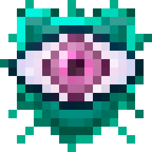

## End Veil

> [!infobox-narrow] Infobox
>
> 

The **End Veil** effect makes it so that [Endermen](https://minecraft.wiki/w/Enderman)
will not become hostile merely because the player looks at them.

It can be obtained in one of a few ways:
- Drinking [Suspicious Stew](https://minecraft.wiki/w/Suspicious_Stew) obtained
  by milking a [Glossy Mooshroom](Mobs/glossy_mooshroom)
- Consuming a [Potion](https://minecraft.wiki/w/Potion) brewed from using a [Fur](tags/fur)

> [!info] Changed from Better End
> In Better End, End Veil was a helmet enchantment.

--- [Edit this page on GitHub](https://github.com/OpenBagTwo/LighterEnd/edit/wiki/content/misc.md)
