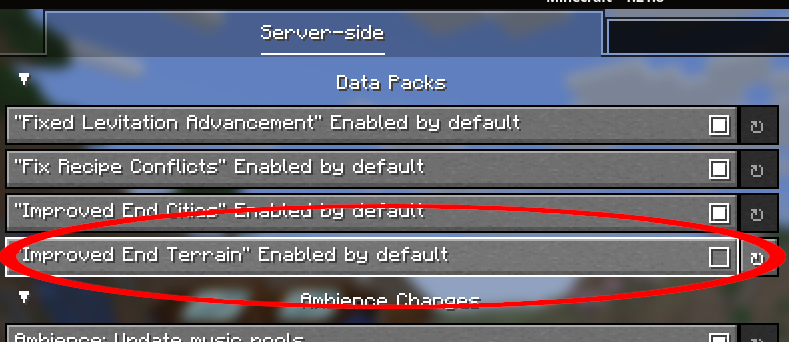

Due to Lighter End's lightweight implementation, it should be broadly compatible with a wide range of
other End mods, though ones with custom world generation may require additional work to balance
the biome source.

## Nullscape

✅ **Fully Compatible**

Lighter End was explicitly developed with
[Nullscape's](https://modrinth.com/datapack/nullscape)
world generation in mind and will inject its biomes
into Nullscape's biome source.

_last tested: [v1.2.14](https://modrinth.com/datapack/nullscape/version/JuMNLwUQ)_

## Moog's End Structures

✅ **Fully Compatible**

[Moog's End Structures](https://modrinth.com/mod/mes-moogs-end-structures)
beautifully compliment Lighter End's general aesthetic.
Use of MES is highly recommended.

_last tested: [1.4.7 for 1.21.10](https://modrinth.com/mod/mes-moogs-end-structures/version/Am6lGk8F)_

## Better End Sky

✅ **Fully Compatible**

[Better End Sky](https://modrinth.com/mod/better-end-sky) is fully compatible with Lighter End.

_last tested: [0.3.0 for 1.21.10](https://modrinth.com/mod/better-end-sky/version/0.3.0+1.21.10)_

## Elytra Trims

☑️  **Mostly Compatible**

While Lighter End only applies trims to Silk Elytra, the textures are adapted from
[Elytra Trims](https://modrinth.com/mod/elytra-trims), and installing that mod will allow
regular elytras to be trimmed as well. However, disabling the "Wing Trims" optional
resource pack will disable wing trims with both mods.

_last tested: [4.4.2 for 1.21.10](https://modrinth.com/mod/elytra-trims/version/4.4.2)_

## Stellarity

⚠️  **Partially Compatible**

As with [Nullscape](#nullscape), Lighter End injects its list of biomes into Stellarity's
biome source. However, Lighter End's biomes are much smaller—and rarer—under
Stellarity's world generation.

_last tested: [v5.1.2 for 1.21.10](https://modrinth.com/datapack/stellarity/version/5.1.2)_

## Enderscape

⚠️  **Partially Compatible**

[Enderscape](https://modrinth.com/mod/enderscape) by default provides its own world generation
that overwrites Lighter End's biome source. To use Lighter End with Enderscape, go into
Enderscape's configuration and **disable** "Improved End Terrain"



_last tested: [1.1.1 for 1.21.8](https://modrinth.com/mod/enderscape/version/1.1.1)_

## TerraBlender

✅ **Fully Compatible**

Lighter End registers its biomes with [TerraBlender's](https://modrinth.com/mod/terrablender) API
and arguably produces much more exciting worldgen results compared to vanilla. However, you may
choose to tweak TerraBlender's settings by editing the `terrablender.toml` file in your Minecraft's
`config` folder to make vanilla biomes more common.

_last tested: [21.10.0.0 for Fabric 1.21.10](https://modrinth.com/mod/terrablender/version/kzbTmNaX)_

### Biomes O' Plenty

✅ **Fully Compatible**

Explicitly: Lighter End biomes will generate alongside
[Biomes O'Plenty's](https://modrinth.com/mod/biomes-o-plenty) End biomes, though I personally would
suggest disabling the End Corruption by setting:
```json
  "end_corruption_enabled": false,
```
in `config/biomesoplenty/biome_toggles.json`

_last tested: [21.10.0.2 for Fabric 1.21.10](https://modrinth.com/mod/biomes-o-plenty/version/EThFDdyw)_

--- [Edit this page on GitHub](https://github.com/OpenBagTwo/LighterEnd/edit/wiki/content/mods.md)
